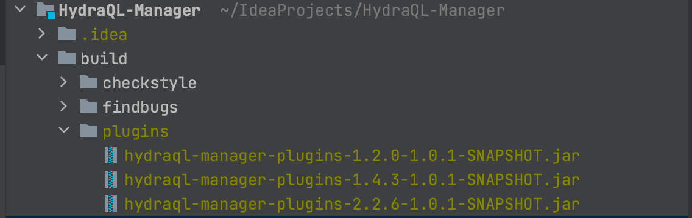

## 1. 平台简介

HBase表管理系统

## 2. 编译指南

HydraQL-Manager 编译依赖HydrqQL项目的编译，所以先了解

### 2.1 编译插件

根据需要的一个或多个HBase版本，先编译需要的插件：

```shell
默认编译版本1.2.0
mvn -T 2C clean -U install -pl shaded/shaded-hbase/ -Dmaven.test.skip=true
mvn -T 2C clean -U install -pl plugins/ -Dmaven.test.skip=true


指定版本
mvn -T 2C clean -U install -pl shaded/shaded-hbase/ -Dmaven.test.skip=true -Dhydraql.hbase.profile=1.4 -Dhydraql.hbase.version=1.4.3
mvn -T 2C clean -U install -pl plugins/ -Dmaven.test.skip=true -Dhydraql.hbase.profile=1.4 -Dhydraql.hbase.version=1.4.3

mvn -T 2C clean -U install -pl shaded/shaded-hbase/ -Dmaven.test.skip=true -Dhydraql.hbase.profile=2.2 -Dhydraql.hbase.version=2.2.6
mvn -T 2C clean -U install -pl plugins/ -Dmaven.test.skip=true -Dhydraql.hbase.profile=2.2 -Dhydraql.hbase.version=2.2.6
```

插件编译后默认生成的目录是
项目根目录/build/plugins



编译console

```shell
mvn -T 2C clean -U package -pl console/ -Dmaven.test.skip=true
```

编译web

```shell
cd 项目根目录/web
mvn -T 4C clean -U package -Dmaven.test.skip=true
```